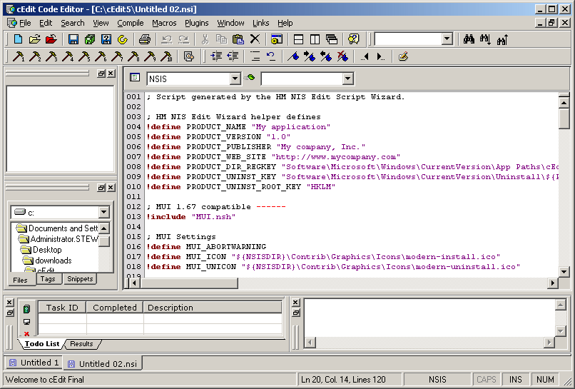



## cEdit

### Description

This is an update to the 4.0 series of cEdit. This has a couple of bug fixes. The primary fix is to the line highlighting problem submitted by leo nunez. This is a full code editor written in Visual Basic. It utilizes the CodeSense control, and the TabDock control. CodeSense provides syntax highlighting and tabdock provides window docking support.

Download it with the OCX files at http://cedit.sourceforge.net/cEdit.zip

Check out http://cedit.sourceforge.net to get newer releases including cEditMX
 
### More Info
 

             |
---                |---
**Submitted On**   |2005-05-31 04:24:42
**By**             |[Stewart](https://github.com/Planet-Source-Code/PSCIndex/blob/master/ByAuthor/stewart.md)
**Level**          |Intermediate
**User Rating**    |4.6 (82 globes from 18 users)
**Compatibility**  |VB 6\.0
**Category**       |[Complete Applications](https://github.com/Planet-Source-Code/PSCIndex/blob/master/ByCategory/complete-applications__1-27.md)
**World**          |[Visual Basic](https://github.com/Planet-Source-Code/PSCIndex/blob/master/ByWorld/visual-basic.md)
**Archive File**   |[cEdit189552612005\.zip](https://github.com/Planet-Source-Code/stewart-cedit__1-60848/archive/master.zip)

